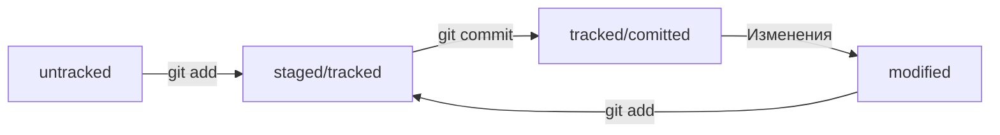

 # Настройка окружения и знакомство с командной строкой  

 ## Командноа строка

 Если вы пользователь macOS или Linux, запустите программу **Terminal**. Её можно найти через окно поиска операционной системы. А можно использовать комбинацию горячих клавиш:  
 * для Linux — ```Ctrl+Alt+T```;
 * для macOS — ```Cmd+Space```, затем ввести ```terminal```.   
 Если вы пользователь Windows, запустите программу Git Bash.  


 Узнать, где вы сейчас, поможет команда ```pwd```. Она выводит путь к текущей директории.  
 Для перехода к домашней директории нужно ввести команду ```cd``` и символ ```~``` — обозначение домашней директории.    

### Знакомство с командной строкой

- Вывести содержимое директории — ```ls```.  
Вызов ```ls -a``` выведет расширенный список. В нём отобразятся все скрытые файлы, которые начинаются с символа ```.``` (например, файлы конфигурации). В том числе два особых файла ```.``` и ```..```, которые обозначают текущую и родительскую директории.  

- Сменить директорию — ```cd```.  
Она меняет текущую рабочую директорию на ту, которая указана в качестве параметра: ```cd имя_папки```.  
Обратите внимание: если в названии папки есть пробелы, при вводе нужно использовать кавычки:  ```cd "Фотографии с дня рождения"```.  

### Навигация в командной строке

### Операции с папками и файлами
- Создание файла и директории
Создание файлов: ```touch %ИМЯ_ФАЙЛА1 [ИМЯ_ФАЙЛА2 ИМЯ_ФАЙЛА3]%```.  
Создание директории: ```mkdir %ИМЯ_ДИРЕКТОРИИ%```.  
Создание структуры директорий: ```mkdir -p %ИМЯ_ДИРЕКТОРИИ1/ИМЯ_ДИРЕКТОРИИ2/ИМЯ_ДИРЕКТОРИИ3%```.  
- Копирование файла
Копирование файла: ```cp что_копируем куда_копируем ```
Копирование файлов: ```cp что_копируем что_копируем что_копируем куда_копируем```
- Перемещение файлов и папок
Перемещение файла: ```mv что куда ```
- Чтение файла
Чтение файла: ```cat %ИМЯ_ФАЙЛА%```  
Команда cat работает только с текстовыми файлами.  
- Удаление файлов и папок
Удаление файла: ```rm %ИМЯ_ФАЙЛА%```  
Удаление директории: ```rmdir %ИМЯ_ДИРЕКТОРИИ%```.  
Удаление директории вместе со всем её содержимым: ```rm -r %ИМЯ_ДИРЕКТОРИИ%```  

### Эффективная работа с командной строкой
- Команды в терминале необязательно вбивать и выполнять по очереди. Их можно указывать не по одной, а сразу списком. Для этого их нужно разделить двумя амперсандами (```&&```).  
- Чтобы обратиться к последней введённой команде, нажмите на клавиатуре стрелку вверх (```↑```). Если нажать ещё раз, появится предпоследняя команда; ещё раз — предпредпоследняя; и так далее. Чтобы вернуться — например, от предпоследней команды к последней, — нажмите стрелку вниз (```↓```).  
- ```Tab``` автоматически дописывает не только команды, но и пути. Начните печатать имя папки или файла (они должны быть в той же директории) и нажмите Tab.  
## Настройка Git 
- Работа с файлом настройки ```.gitconfig```
Нужно представиться и указать имя пользователя и адрес электронной почты с помощью команды git config (от англ. configuration — «конфигурация», «настройка») с ключом --global (англ. «глобальный»). При этом не имеет значения, в какой директории вы находитесь прямо сейчас: вызов git config --global сработает везде.  
В качестве значения user.name нужно указать своё имя или никнейм. Для настройки параметра user.email указывают электронную почту.  
 ```
 git config --global user.name "User Namovich"
 git config --global user.email username@yandex.ru
 ```  

Cпособ проверки — вывести содержимое файла конфигурации Git той же командой git config с флагом --list (англ. «список»).
``` git config --list ```

# Начало работы с Git

## Первый коммит
- Сделать папку репозиторием — ```git init```
- «Разгитить» папку, если что-то пошло не так, — ```rm -rf .git```
- Проверить состояние репозитория — ```git status```
- Подготовить файлы к сохранению — ```git add``` (--all)
- Выполнить коммит — ```git commit -m 'message' ```
 - Просмотреть историю коммитов — ```git log```

## Работа с GitHub


## Синхронизация репозиториев
### Генерация SSH ключа
- Проверка наличия SSH-ключа
```
cd ~
ls -la .ssh/
```
Если папка пустая или её нет, всё в порядке.  
Если есть файлы с похожими названиями, SSH-ключи уже создавались:  
* id_dsa.pub;
* id_ecdsa.pub;
* id_ed25519.pub;
* id_rsa.pub.  


- Инструкция по генерации SSH-ключа
Для генерации SSH-пары можно использовать программу ssh-keygen. Откройте терминал и введите следующую команду.
```$ ssh-keygen -t ed25519 -C "электронная почта, к которой привязан ваш аккаунт на GitHub" ```  
Используйте электронную почту, к которой привязан ваш GitHub-аккаунт.  
Если вы видите сообщение об ошибке, то, скорее всего, ваша система не поддерживает алгоритм шифрования ed25519. Ничего страшного: используйте другой алгоритм.  
```$ ssh-keygen -t rsa -b 4096 -C "электронная почта, к которой привязан ваш аккаунт на GitHub" ```  
После ввода отобразится такое сообщение.  
```> Generating public/private rsa key pair. # сгенерированы публичный и приватный ключи```  
Укажите место хранения ключей. Простой вариант — сделать домашний каталог пользователя путём по умолчанию. Для этого нажмите Enter.  
Теперь в указанной директории появится пара ключей.  
Программа запросит кодовую фразу (англ. passphrase) для доступа к SSH-ключу. Вы можете оставить поле пустым. Для этого нажмите Enter, а затем ещё раз Enter для подтверждения.  
```
> Enter passphrase (empty for no passphrase): [Type a passphrase]
> Enter same passphrase again: [Type passphrase again] 
```  
Готово! Теперь осталось проверить, что ключи действительно сгенерировались. Для этого вызовите эту команду.  
```ls -a ~/.ssh ```  
На экране должны появиться два файла — один с расширением .pub, другой — без. Файл в .pub — публичный, им можно делиться с веб-сайтами или коллегами. Файл без расширения .pub — приватный. Ни в коем случае не передавайте его никому! 

### Связь локального и удаленного репозироиев

- Привязать удалённый репозиторий к локальному — ```git remote add origin git@github.com:%ИМЯ_АККАУНТА%/%first-project%.git```
- Убедиться, что репозитории связаны, — ```git remote -v```

### Синхронизация локалоного и удаленного репозитория

- Отправить изменения на удалённый репозиторий — ```git push -u origin main```
В первый раз эту команду нужно вызвать с флагом ```-u``` и параметрами ```origin``` (имя удалённого репозитория) и ```main``` или ```master``` (название текущей ветки).   

### Файл README.md
- [Шпаргалка по markdown](https://practicum.yandex.ru/trainer/git-basics/lesson/c6b9607c-e8bc-4446-89f9-c74522c3492f/ "Файл README.md")  


## Навигация по коммитамю Статусы файлов   

### Хеш - идентификатор коммита  

- Обычно хеш — это короткая (40 символов в случае SHA-1) строка, которая состоит из цифр 0 — 9 и   
латинских букв A—F (неважно, заглавных или строчных).  
- Все хеши и таблицу ```хеш → информация``` о коммите Git сохраняет в служебные файлы. Они находятся в скрытой папке ```.git``` в репозитории проекта.  

### Исследуем лог  
Разберём элементы, из которых состоит описание:  
- строка из цифр и латинских букв после слова commit — это хеш коммита;
- Author — имя автора и его электронная почта;
- Date — дата и время создания коммита;
- в конце находится сообщение коммита.  

Получить сокращённый лог — ```git log --oneline```  

### HEAD — всему голова  

- в папке .git есть служебный файл HEAD. Он указывает на самый свежий коммит.
- вместо хеша последнего коммита можно написать слово HEAD — Git вас поймёт.

### Статусы файлов в Git  



### Как читать git status  

```git status``` показывает только следующие состояния файлов:  
- staged (Changes to be committed в выводе git status);
- modified (Changes not staged for commit);
- untracked (Untracked files).

## Работа над ошибками в коммитах 

### Оформление сообщений к коммитам  

Хорошо, когда:
- сообщение коммита легко читается;
- оно информативное;
- все сообщения оформлены в одном стиле.


